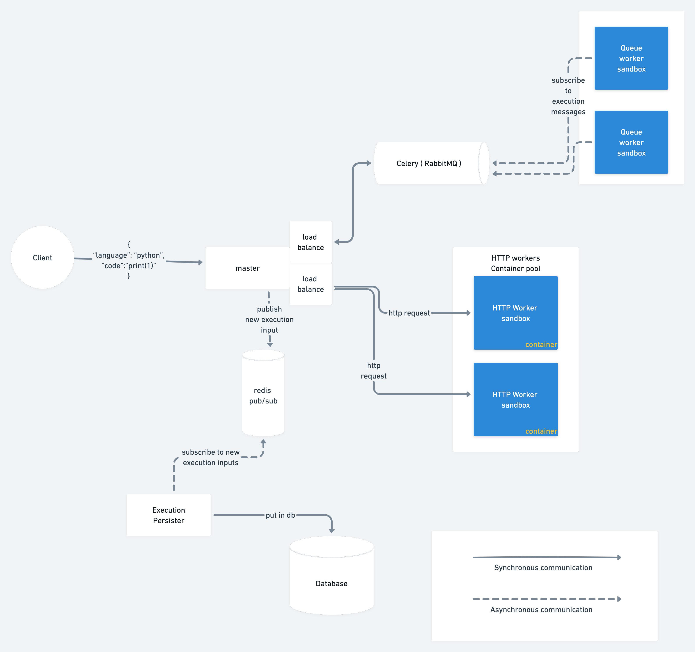

# Remote code execution
Have you ever wondered:
- how some web apps like: "hackerrank", "algoexpert", "leetcode" and others  execute the code you write on the client side?
- How these web apps compile and run unknown code without any security threats? 
- How they manage to deal with dozens of different languages and their version in a scalable manner?

"Remote code execution engine" - project is an API, which allows you to run code passed via HTTP request to a server in 
a secure sandbox environment of active docker containers.

So if you want to have an API where you will send your code for execution and results check this project out.

# System Supported languages
This is a list of languages current API can execute and work with:
- python
- javascript

# Pre-requisites
- docker
- docker-compose
- shell ( any UNIX like system compilant )

# Setup 
- Enter the folder where main docker compose file is preset: `cd container`
- Startup docker-compose services which use several dockerfiles located in nested directories: `docker-compose up -d --build --force-recreate`

# Usage
At the moment there is HTTP Rest api present for executing code in docker sandboxed containers.
To see full list of API endpoints please look at OpenAPI specification that comes with server ( Please see port on fastAPI official page ).
## General overview of endpoint functionalities
For small load of executions ( for testing, and etc ), which uses separate HTTP workers under the hood, so in high load this will become slow for end users:
- Endpoint: /api/run/
- Method: POST
- HTTP request body: { code: str, language: str }
For bigger load of executions ( which will be the case in most of the cases in production like environment ), which uses Message queue ( RabbitMQ ) under the hood, to leave
jobs of tasks of code executions which will execute at some point in time. So after leaving a task/job client-side will have to periodically fetch for update in result status:
- Endpoint: /api/schedule
- Method: POST
- HTTP request body: { code: str, language: str }
To check status and result of left job/task on the previous api endpoint
- Endpoint: /api/schedule/check/{id}
- Method: GET

# Architecture

